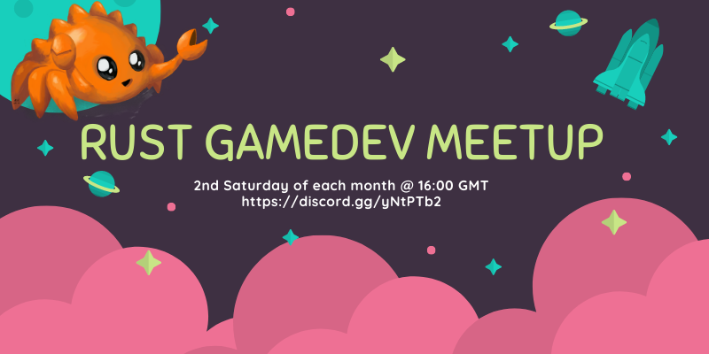

# Rust Gamedev Meetup

## About

The Rust Gamedev Meetup is a virtual gathering where members of the community
come together to show off what they've been working on. The meetup takes place
on the second Saturday of each month at 16:00 GMT. Each meetup aims to be about
1.5 hours long and will consist of a series of "show and tell" presentations,
where participants will have up to 15 minutes to discuss their topic.

## How to Attend

To attend the meetup, simply tune in to the live stream on
[YouTube](https://www.youtube.com/@RustGameDevelopment) or
[Twitch](https://www.twitch.tv/rustgamedev). After the meetup, there will be a
hangout session on [Discord](https://discord.gg/yNtPTb2) where attendees can
continue the conversation.

## How to Sign Up to Speak

If you would like to speak at the meetup, please respond to the monthly GitHub
issue that will be created. This is where speakers will be selected and the
presentation schedule will be organized. The stream is hosted on StreamYard, and
you'll get a link to the stage the day of the meetup.

## Contact

For any questions or suggestions, please contact the organizers through the
meetup's GitHub repository or through the Discord channel.
